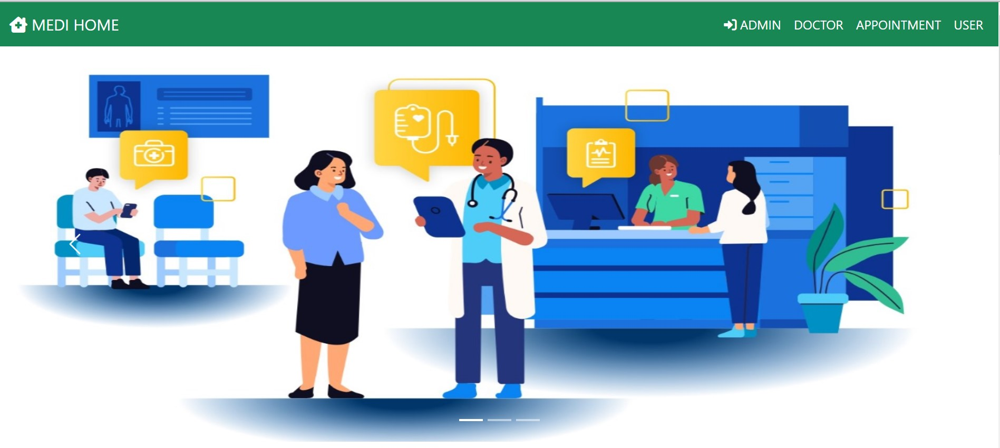
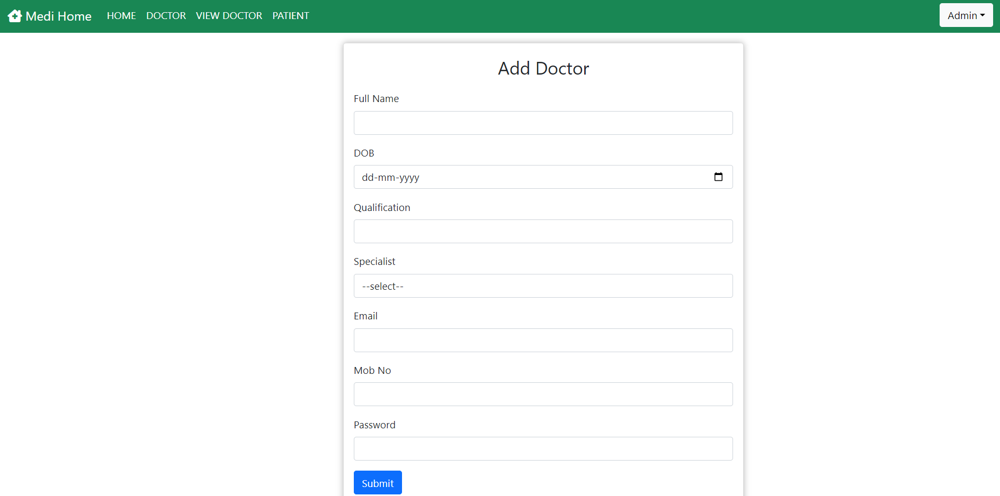
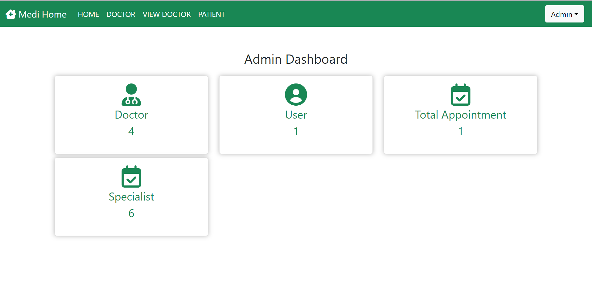
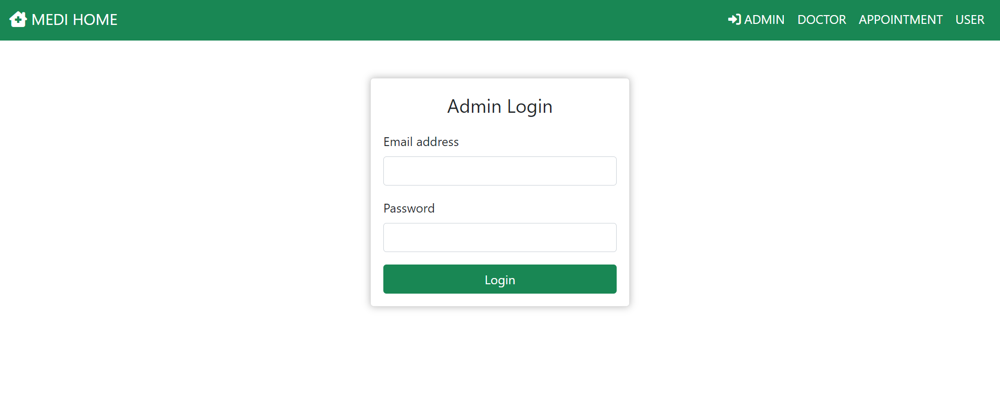
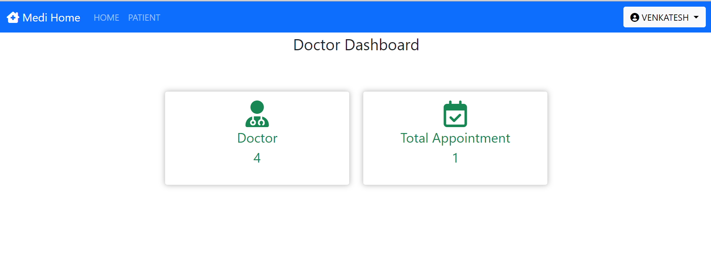
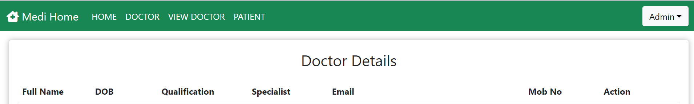
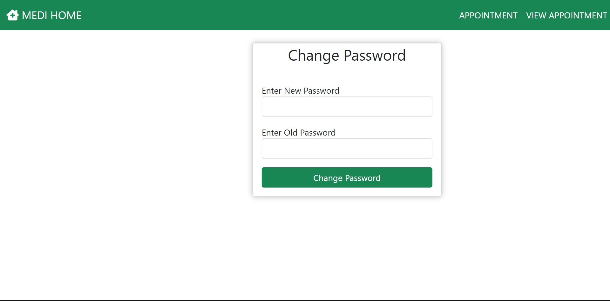
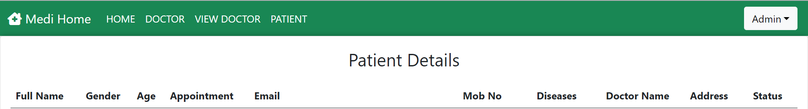
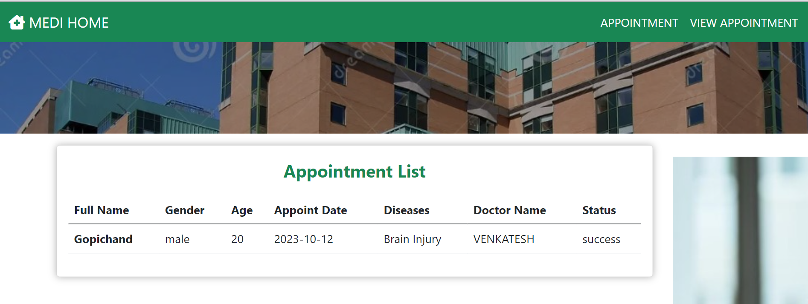
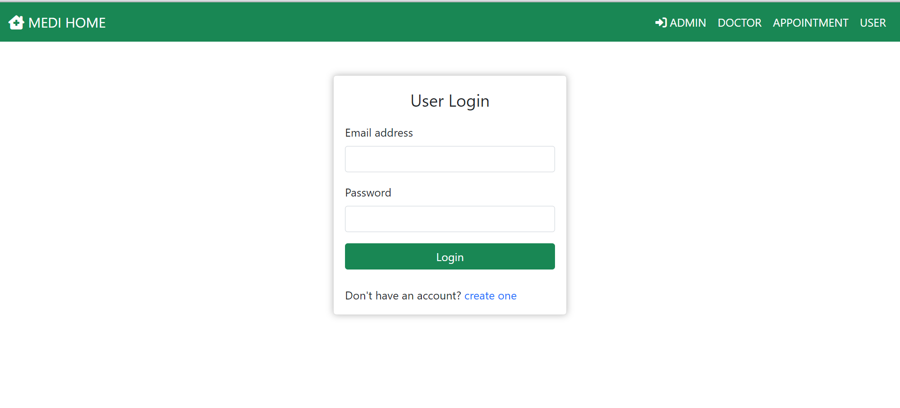

# Hospital Management System

## Overview
The Hospital Management System is a comprehensive solution designed to streamline and automate various administrative and operational tasks within a hospital or healthcare facility. It facilitates efficient management of patient records, appointments and more.

## Features
- **Patient Management**: Maintain detailed records of patients including personal information, medical history, diagnosis, treatment plans, and follow-up appointments.
- **Appointment Scheduling**: Allow patients to schedule appointments online and manage appointment slots for doctors and specialists.
- **Electronic Medical Records (EMR)**: Digitize and store patient health records securely. Enable authorized personnel to access patient information remotely and securely.
- **Laboratory and Imaging Integration**: Integrate with laboratory and imaging services to streamline test orders, results, and reports.
- **Pharmacy Management**: Manage pharmacy inventory, prescriptions, dispensing, and medication orders.
- **Reporting and Analytics**: Generate reports on patient demographics, admissions, revenue, expenses, and other key performance indicators (KPIs). Analyze data to identify trends and make informed decisions.
- **Security and Compliance**: Implement robust security measures to protect patient data and ensure compliance with healthcare regulations such as HIPAA (Health Insurance Portability and Accountability Act).
- **Mobile Access**: Provide mobile access to key features for patients, doctors, and staff through a secure and user-friendly mobile application.

## Technologies Used
- **Frontend**: HTML, CSS, Bootstrap 
- **Backend**: Java, Servlet, JSP, JDBC
- **Database**: MySQL
- **Version Control**: Git, GitHub

## Screenshots

## Usage
- Access the application from the provided URL or run it locally on your machine.
- Register as a new user (patient, doctor, or staff) or log in if you already have an account.
- Explore different features such as appointment scheduling, medical records, billing, etc.
- Provide feedback and report any issues or suggestions for improvement.

